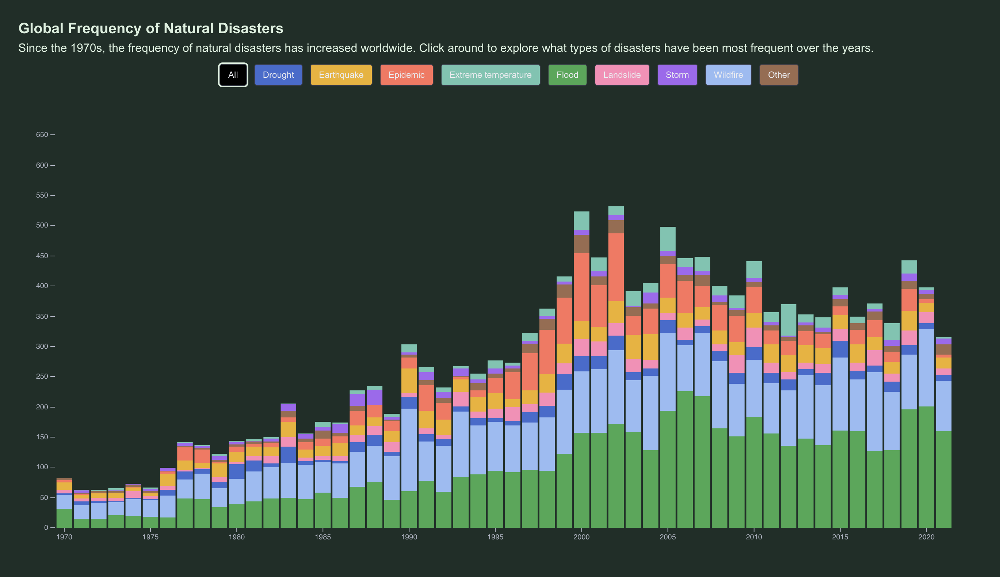

# Natural Disasters 1970 - 2021

## Suchi Tailor

## Description

My project examines the increasing frequency of natural disasters on a global scale. Along side frequency, 
it demonstrates how Natural Disasters have grown increasingly expensive over the years. The product encourages readers to reflect on why it might be more expensive - perhaps due to increasing intensity, frequency or both. Lastly, it allows the reader to drill down on how natural disasters are impacting specific regions of the world. Below is a snapshot: 

## Data

- Kaggle: https://www.kaggle.com/datasets/brsdincer/all-natural-disasters-19002021-eosdis/data - License: http://opendatacommons.org/licenses/dbcl/1.0/
- Our World in Data: https://ourworldindata.org/grapher/economic-damage-from-natural-disasters?time=1922..2024 - License: https://creativecommons.org/licenses/by/4.0/
