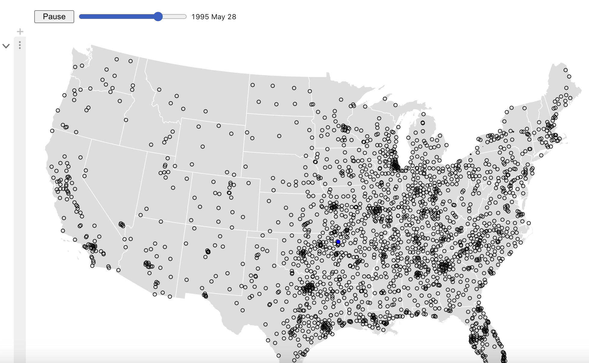

**Name:** Suchi Tailor

**Data:**
* Natural Disasters Data set from Kaggle:
    * https://www.kaggle.com/datasets/brsdincer/all-natural-disasters-19002021-eosdis/data
    * This dataset from Kaggle outlines global natural disasters from 1970 to 2021 and also from 1900 to 2021. It includes breakout by continent, regions and countries. It also breaks down natural disasters by type. There is some data on deaths from the natural disasters, costs, etc., but I will have to do a deeper dive on how much data is there and if it is reasonable to display in my narrative.
* Latitude and Longitude of each Country from Kaggle:
    * https://www.kaggle.com/datasets/paultimothymooney/latitude-and-longitude-for-every-country-and-state
    * this data set contains the latitude and longitudes of countries and will be useful for any mapping visualizations that I do
* World Bank GDP data
    * https://data.worldbank.org/indicator/NY.GDP.PCAP.CD
    * This data set breaks down GDP per capita by country. I think it could be interesting to examine GDP patterns following a natural disaster by country. 

**Examples:**
* Deadliest Natural Disasters
    * https://especiales.eldiario.es/spain-lives-in-flats/
    * This would probably require a bit more thinking, but I could put together data on the top 5-6 deadliest natural disasters in recent history. The scrollable element will take me to the specific part of the world it took place. I would have facts and data about each natural disaster in a narrative format, somewhat similar to the linked visualization here. If I did this, I probably would need to find more specific data for each chosen disaster. 
    * This idea aligns with option A.
* Map over time
    * https://observablehq.com/@d3/walmarts-growth
    * I would do a global map that showed the occurrence of natural disasters over time. Some additional ideas are to include a drop down to show specific types of natural disasters. If possible, I could add an additional zoom to bounding box feature
    * Depending on amount of interactivity I think this aligns with option A or B.
* Zoom to Bounding Box
    * https://observablehq.com/@d3/zoom-to-bounding-box
    * Alternatively, it could also be interesting to do a zoom to bound box of natural disasters globally, with the same concept of including different dots/markers based on the type of natural disasters. Here, I would either need to use aggregate data (all disasters from 1970-2021) or have some kind of feature that would allow me to select specific time periods. 
    * This probably aligns with option B
* Hierarchical Bar Chart 
    * https://observablehq.com/@d3/hierarchical-bar-chart
    * this hierachical bar chart is a great way for me to display total disasters by region, subregion and then country. at the country level I could drill down on disaster type. This data would be aggregate, but again, I could add some kind of feature that would allow me to select specific time periods. 
    * This probably aligns with option B

**Images**

The below photos demonstrate what I would be envisioning for the Map over time. This would largely be a simulation wehre people can hit play. 
